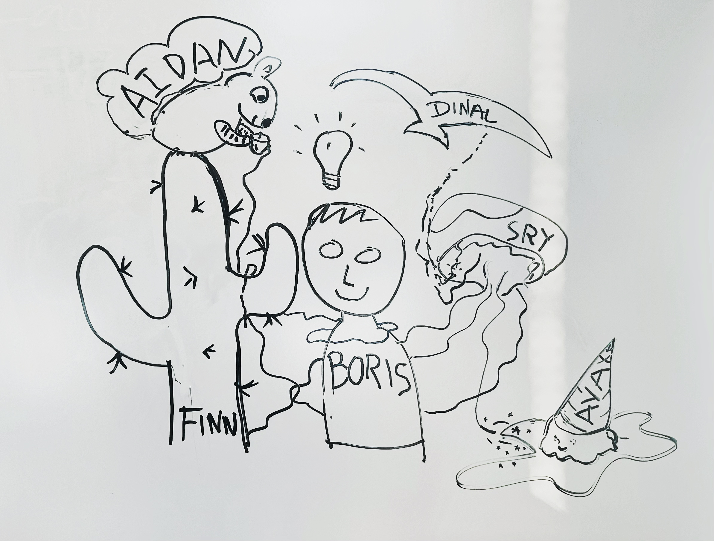
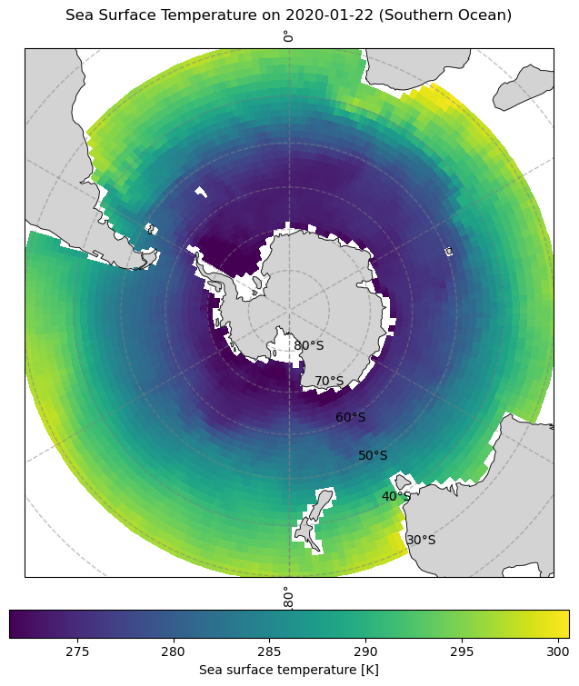
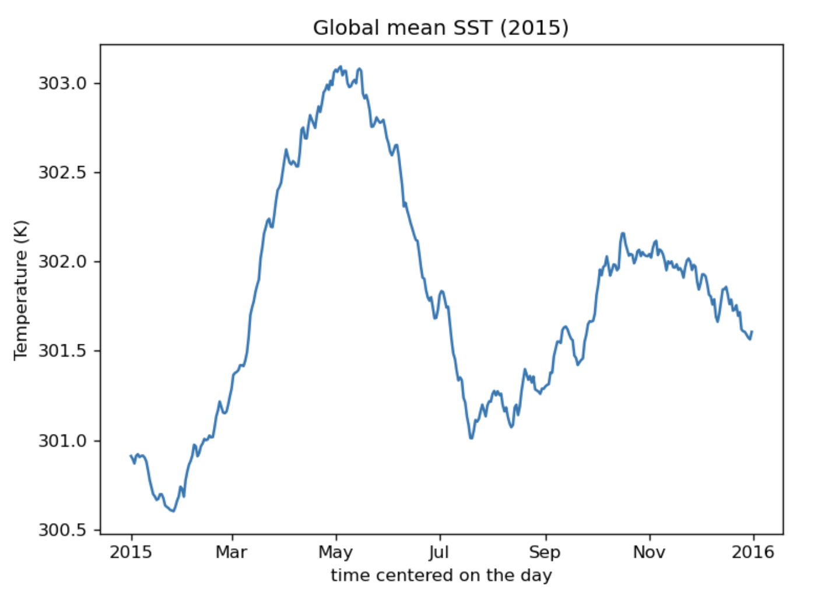
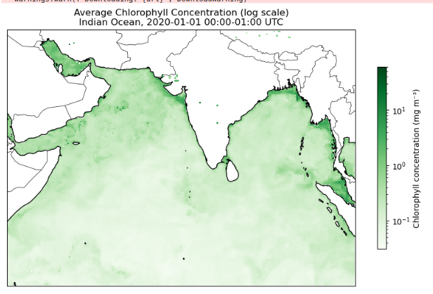

# ohw25_proj_datadashboard_llm

**Repo Structure**

* `contributor_folders` temp folder for individual work

* `final_notebooks`:  
  - `final_dashboard.py` Marimo dashboard  
  - `llm_working_tutorial` demonstration of the working flow of LLM --> plotting  
  - `demo` example/demo notebooks 

* `scripts` backend python scripts to control data access, tools available to the model, etc
* `data` data will all be cloud accessed. Will add links to cloud buckets once we have decided on which dataset we want to incorporate
  
* `photo` store figures and photo

* `pixi.toml` working environment setup

## Data Dashboard powered by LLM:

### Planning
This reppository hold all code needed to run our LLM-powered climate data analysis dashboard. The project is in its early stages but will consistent of an app interface (containing interactive map, text box, and model output return) as well as a backend for LLM-driven data loading, visualization, and analysis. 

* Check out the preliminary code structure here: https://www.figma.com/community/file/1539761856510676831
* Ideation Presentation: Not yet available
* Slack channel: ohw25_proj_llm
* Project google drive: N/A
* Final presentation: Not yet available

### Collaborators

| Name                |Github              | Role               |
|---------------------|--------------------|--------------------|
| Boris Shapkin       | boryasbora         |Project Facilitator |
| Liangtong Wei       | sryisjelly         |Participant         |
| Finn Wimberly       | finnwimberly       |Participant         |
| Ava Wessel          | awessel3           |Participant         |
| Aidan Lewis         | aidan-axiom        |Participant         |
| Dinal Meecle        | dinalmeecle        |Participant         |

## Background
Boris has some chatbot experience... the rest of us are comfortable with python and excited to learn 

## Goals
Have a functioning interactive dashboard that users can use natural language ask it to plot the figures they want (e.g., mean sea surface
temperature in some region, sea level anomaly time series in a year, etc)

## Datasets
can be found here:  [datasets](https://github.com/oceanhackweek/ohw25_proj_datadashboard_llm/blob/main/data/dataset_track.ipynb)

## Workflow/Roadmap
|UI                     ----->  |LLM(Large Language Model)              ----->    |Create Plot                                      |
|-------------------------------|-------------------------------------------------|-------------------------------------------------|
|Use Marimo to build dashboard, |connect llm to one data set for initial testing, |extend as far as we can to achieve the **Goals**.|

## Results/Findings

<!-- Centered, smaller Marimo plot -->

  

The final marimo dashboard can be found in the `final_notebooks` folder. 

This dashboard comprises of interactive map and a chatbot to select and run analysis on chosen data. All users must have an HF token key from Hugging Face: https://huggingface.co/

<!-- Side-by-side tutorial & LLM plots -->

  
  

The demonstration of LLM working flow in our project can be found in `/final_notebooks/llm_working_tutorial` folder.

This tutorial provides an exmaple **LLM → plotting pipeline**. It takes a natural-language plotting request, calls an LLM API to generate pure Python/matplotlib code, and creates the asked plot. It doesn’t train a new LLM, but lets you plug in your own OpenAI-compatible/HF endpoint to generate the plots.

## Lessons Learned
Lots of moving parts in this project! Difficult to track keep track of/connect components. Marimo was hyped... but proved difficult. We are not about it. Keep your API keys hidden and protect your pennies.

## References
In the works...
